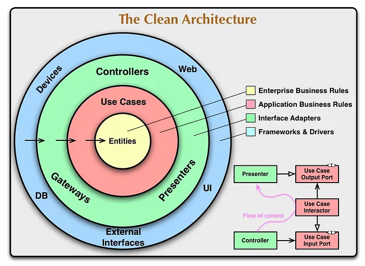

# Clean Architecture

## แผนภาพ



### 1. Entities

มีหน้าที่ กำหนดโครงสร้างของข้อมูล เช่น ต้องการเขียน Service API สำหรับ User ที่สมัครสมาชิก Entities ก็ควรจะประกอบไปด้วย **Interface หรือ Struct** ของ Request และ Response สำหรับ การสมัครสมาชิก

### 2. Repositories

มีหน้าที่ ในการรับส่ง Entities เข้าออกจาก Database หรือพูดง่ายๆ ก็คือมีหน้าที่ **Query ข้อมูลจาก Database**

เช่น ในกรณีสมัครสมาชิก ควรจะมี Function สำหรับ Insert ข้อมูล User เข้าไปใน Database

### 3. Usecases

มีหน้าที่รับมือกับ Logic ต่าง ๆ ก่อนที่จะส่งข้อมูลเข้าออก Database เช่น Search, Sort, Hash เป็นต้น

ถ้าต้องการเขียน Usecase สำหรับการสมัครสมาชิกของ User ควรมี Logic ในการ Hash Password (เข้ารหัส) ให้กับ user เพื่อความปลอดภัยก่อนที่จะส่งเข้า Database

### 4. Controllers

มีหน้าที่ในการรับส่ง Context จาก HTTP Request หรือพูดง่าย ๆ ก็คือ รับส่งข้อมูลหรือบริบทต่าง ๆ ที่ถูกยิงมากจาก API ที่ client ทำการยิงมา

โดยในการสร้าง Controller สำหรับการสมัครสมาชิก ก็ควรจะมี Endpoint และ ใช้เป็น Method POST เพื่อรับ Body ที่ Request มาจาก Client เพื่อทำการสมัครสมาชิก และเราก็อาจจะมีการตรวจสอบข้อมูลที่ส่งเข้ามาเล็กน้อย ก่อนส่งต่อเข้า Usecase ให้ไปทำงานในลำดับถัดไป

## folder structure

```markdown-notes-tree
📂 app/
├─ 📄 main.go
📂 assets/
├─ 📂 logs/
📂 configs/
├─ 📄 configs.go
📂 modules/
├─ 📂 servers/
│  ├─ 📄 server.go
│  ├─ 📄 handler.go
├─ 📂 entities/
│  ├─ 📄 users.go
│  ├─ 📄 response.go
├─ 📂 users/
│  ├─ 📂 controllers/
│  │  ├─ 📄 users_controllers.go
│  ├─ 📂 usecases/
│  │  ├─ 📄 users_usecases.go
│  ├─ 📂 repositories/
│  │  ├─ 📄 users_repositories.go
📂 pkg/
├─ 📂 databases/
│  ├─ 📂 migrations/
│  ├─ 📄 postgresql.go
├─ 📂 middlewares/
├─ 📂 utils/
│  ├─📄 connection_url_builder.go
📂 tests/
├─ 📂 users/
│  ├─ 📄 users_test.go
📄 .env
```

ในการเขียน Clean Architecture เราจะแยกเป็น Modules เพื่อความ Clean ในที่นี้มีแต่ users แต่ถ้าเกิดว่า โปรเจค E-Commerce ก็อาจจะมี หลาย Modules อย่างเช่น users, products, orders, …

แล้วในแต่ละ Module นั้นจะประกอบไปด้วย Contollers, Usecases, และ Repositories ส่วน Entities ก็อยู่ใน Module เหมือนกัน แต่ว่าเราสร้าง Folder แยกมาไว้ต่างหาก เพื่อความง่ายในการเข้าถึง แต่ถ้าใครอยากจะสร้าง Entities ให้อยู่ในแต่ละ Module แยกกันไปเลยก็ได้เหมือนกัน

## ตัวอย่าง Code

ต่อจากนี้เป็นแนวทางในการเขียน code  ถ้าหากว่าไม่รู้ว่าไฟล์ไหนอยู่ตรงไหนให้ย้อนไปดูที่ folder structure

### กำหนด Configs

ใน Configs จะสร้าง Struct ให้แต่ละอย่าง ยกตัวอย่างใน Config นี้จะมีของ Database และ App (GO Fiber) ตามนี้

```go
package configs

type Configs struct {
 PostgreSQL PostgreSQL
 App        Fiber
}

type Fiber struct {
 Host string
 Port string
}

// Database
type PostgreSQL struct {
 Host     string
 Port     string
 Protocol string
 Username string
 Password string
 Database string
 SSLMode  string
}
```

### ไฟล์ .env

```env
FIBER_HOST=0.0.0.0
FIBER_PORT=5000

DB_HOST=0.0.0.0
DB_PORT=1122
DB_DATABASE=clean_arch_db
DB_USERNAME=postgres
DB_PASSWORD=123456
DB_PROTOCOL=tcp
DB_SSL_MODE=disable
```

### โครงสร้าง Module Users

ในการสร้าง Module ควรจะสร้างจาก Layer ชั้นในสุดก่อน แล้วค่อยๆถอยออกมาเรื่อยๆจนถึง Controller ตามลำดับ ดังนี้

1. Entities
2. Repositories
3. Usecases
4. Controllers

เพราะว่าต้อง Return Interface ออกมาเป็นทอด ๆ จากด้านในสุด โดยจะไล่ตามลำดับตั้งแต่ Repositories, Usecases และ Controllers ที่เป็นชั้นนอกสุด

โดย Repositories ก็จะส่งต่อไปให้ Usecases แล้ว Usecases ก็จะส่งต่อให้ Controllers

### Entities

ก่อนอื่นกำหนด Entities ให้กับ users ก่อน โดยจะมี Interfaces ที่ users module สามารถเข้าถึงได้ และมี Struct รองรับโครงสร้างข้อมูลในส่วนของ Request และ Response

```go
package entities

type UsersUsecase interface {
 Register(req *UsersRegisterReq) (*UsersRegisterRes, error)
}

type UsersRepository interface {
 Register(req *UsersRegisterReq) (*UsersRegisterRes, error)
}

type UsersRegisterReq struct {
 Username string `json:"username" db:"username"`
 Password string `json:"password" db:"password"`
}

type UsersRegisterRes struct {
 Id       uint64 `json:"id" db:"id"`
 Username string `json:"username" db:"username"`
}
```

### Repositories

```go
package repositories

import (
 "fmt"
 "github.com/jmoiron/sqlx"
 "backend/modules/entities"
)

type usersRepo struct {
 Db *gorm.DB
}

func NewUsersRepository(db *gorm.DB) entities.UsersRepository {
 return &usersRepo{
  Db: db,
 }
}

func (r *usersRepo) Register(req *entities.UsersRegisterReq) (*entities.UsersRegisterRes, error) {
 query := `
 INSERT INTO "users"(
  "username",
  "password"
 )
 VALUES ($1, $2)
 RETURNING "id", "username";
 `

 // Initail a user object
 user := new(entities.UsersRegisterRes)

 // Query part
 rows, err := r.Db.Queryx(query, req.Username, req.Password)
 if err != nil {
  fmt.Println(err.Error())
  return nil, err
 }

 for rows.Next() {
  if err := rows.StructScan(user); err != nil {
   fmt.Println(err.Error())
   return nil, err
  }
 }
 defer r.Db.Close()

 return user, nil
}
```

สังเกต `type usersRepo struct {}`  จะเห็นว่า จะต้องผ่าน Database เข้าไปคือ db แล้วสร้าง Constructor มาหนึ่งตัว คือ `func NewUsersRepository(db *gorm.DB) entities.UsersRepository {}` ที่ต้องผ่าน db เข้าไปก็เพราะว่า ในส่วนของ Repository จำเป็นต้องมีการสื่อสารกับ Database นั่นเอง

### Usecases

```go
package usecases

import (
 "fmt"
 "backend/modules/entities"
 "golang.org/x/crypto/bcrypt"
)

type usersUse struct {
 UsersRepo entities.UsersRepository
}

// Constructor
func NewUsersUsecase(usersRepo entities.UsersRepository) entities.UsersUsecase {
 return &usersUse{
  UsersRepo: usersRepo,
 }
}

func (u *usersUse) Register(req *entities.UsersRegisterReq) (*entities.UsersRegisterRes, error) {
 // Hash a password
 hashed, err := bcrypt.GenerateFromPassword([]byte(req.Password), 10)
 if err != nil {
  fmt.Println(err.Error())
  return nil, err
 }
 req.Password = string(hashed)

 // Send req next to repository
 user, err := u.UsersRepo.Register(req)
 if err != nil {
  return nil, err
 }
 return user, nil
}
```

การสร้าง Users Usecases ก็จะคล้ายๆ กับ repository แต่ต่างกันที่ว่า เราไม่จำเป็นต้องมี Database หรือ Object อื่น ๆ ที่ต้องส่งเข้ามาแล้ว มีแค่ต้องการให้ ตัว Usecases เองเข้าถึง Interfaces ในส่วนของ Repository ได้ก็เพียงเท่านั้นเลยต้องผ่าน Type ของ Interface ในส่วนของ Users Repository เข้าไป

### Controllers

```go
package controllers

import (
 "github.com/gofiber/fiber/v2"
 "backend/modules/entities"
)

type usersController struct {
 UsersUse entities.UsersUsecase
}

func NewUsersController(r fiber.Router, usersUse entities.UsersUsecase) {
 controllers := &usersController{
  UsersUse: usersUse,
 }
 r.Post("/", controllers.Register)
}

func (h *usersController) Register(c *fiber.Ctx) error {
 req := new(entities.UsersRegisterReq)
 if err := c.BodyParser(req); err != nil {
  return c.Status(fiber.ErrBadRequest.Code).JSON(fiber.Map{
   "status":      fiber.ErrBadRequest.Message,
   "status_code": fiber.ErrBadRequest.Code,
   "message":     err.Error(),
   "result":      nil,
  })
 }

 res, err := h.UsersUse.Register(req)
 if err != nil {
  return c.Status(fiber.ErrInternalServerError.Code).JSON(fiber.Map{
   "status":      fiber.ErrInternalServerError.Message,
   "status_code": fiber.ErrInternalServerError.Code,
   "message":     err.Error(),
   "result":      nil,
  })
 }

 return c.Status(fiber.StatusOK).JSON(fiber.Map{
  "status":      "OK",
  "status_code": fiber.StatusOK,
  "message":     "",
  "result":      res,
 })
}
```

ในส่วนนี้มีการ Map Router ให้กับตัว Services Function โดย `func NewUsersController(r fiber.Router, usersUse entities.UsersUsecase) {}` ไม่ต้องมี Return Interface อะไรออกมา เพราะ มันคือชั้นนอกสุดแล้ว หลังจากนี้จะเข้าถึงผ่านการยิง API เพียงเท่านั้น

### สร้าง Servers

โดยใน Module Servers จะมี 2 ไฟล์หลักๆคือ

1. handler.go ทำหน้าที่ Maps Endpoint/Router เข้าด้วยกัน เพื่อให้ตัว Services API สามารถเข้าถึง Modules ต่างๆได้
2. server.go ทำหน้าที่ Start ตัว Server โดยจะไปเรียกใช้ handler.go อีกที

แต่อันดับแรกเลย ก่อนอื่นให้เราสร้าง Function นึงสำหรับต่อ URL ในส่วนของ Database และ App ใน Utils ดังนี้

### Utils

```go
package utils

import (
 "errors"
 "fmt"
 "backend/configs"
)

func ConnectionUrlBuilder(stuff string, cfg *configs.Configs) (string, error) {
 var url string

 switch stuff {
 case "fiber":
  url = fmt.Sprintf("%s:%s", cfg.App.Host, cfg.App.Port)
 case "postgresql":
  url = fmt.Sprintf(
   "host=%s port=%s user=%s password=%s dbname=%s sslmode=%s",
   cfg.PostgreSQL.Host,
   cfg.PostgreSQL.Port,
   cfg.PostgreSQL.Username,
   cfg.PostgreSQL.Password,
   cfg.PostgreSQL.Database,
   cfg.PostgreSQL.SSLMode,
  )
 default:
  errMsg := fmt.Sprintf("error, connection url builder doesn't know the %s", stuff)
  return "", errors.New(errMsg)
 }
 return url, nil
}
```

### จากนั้นไปสร้าง handler.go และ servers.go พร้อมๆกัน

```go
package servers

import (
 _usersHttp "backend/modules/users/controllers"
 _usersRepository "backend/modules/users/repositories"
 _usersUsecase "backend/modules/users/usecases"

 "github.com/gofiber/fiber/v2"
)

func (s *Server) MapHandlers() error {
 // Group a version
 v1 := s.App.Group("/v1")

 //* Users group
 usersGroup := v1.Group("/users")
 usersRepository := _usersRepository.NewUsersRepository(s.Db)
 usersUsecase := _usersUsecase.NewUsersUsecase(usersRepository)
 _usersHttp.NewUsersController(usersGroup, usersUsecase)

 // End point not found response
 s.App.Use(func(c *fiber.Ctx) error {
  return c.Status(fiber.ErrInternalServerError.Code).JSON(fiber.Map{
   "status":      fiber.ErrInternalServerError.Message,
   "status_code": fiber.ErrInternalServerError.Code,
   "message":     "error, end point not found",
   "result":      nil,
  })
 })

 return nil
}
```

```go
package servers

import (
 "log"

 "github.com/jmoiron/sqlx"
 "backend/configs"
 "backend/pkg/utils"

 "github.com/gofiber/fiber/v2"
)

type Server struct {
 App *fiber.App
 Cfg *configs.Configs
 Db  *gorm.DB
}

func NewServer(cfg *configs.Configs, db *gorm.DB) *Server {
 return &Server{
  App: fiber.New(),
  Cfg: cfg,
  Db:  db,
 }
}

func (s *Server) Start() {
 if err := s.MapHandlers(); err != nil {
  log.Fatalln(err.Error())
  panic(err.Error())
 }

 fiberConnURL, err := utils.ConnectionUrlBuilder("fiber", s.Cfg)
 if err != nil {
  log.Fatalln(err.Error())
  panic(err.Error())
 }

 host := s.Cfg.App.Host
 port := s.Cfg.App.Port
 log.Printf("server has been started on %s:%s ⚡", host, port)

 if err := s.App.Listen(fiberConnURL); err != nil {
  log.Fatalln(err.Error())
  panic(err.Error())
 }
}
```

เมื่อสร้าง Servers Module เสร็จเรียบร้อย สร้าง Database Connection ต่อ

### ทำการเชื่อมต่อ Services API กับ PostgreSQL

```go
package databases

import (
 "log"

 _ "github.com/jackc/pgx/v4/stdlib"
 "github.com/jmoiron/sqlx"
 "backend/configs"
 "backend/pkg/utils"
)

func NewPostgreSQLDBConnection(cfg *configs.Configs) (*gorm.DB, error) {
 postgresUrl, err := utils.ConnectionUrlBuilder("postgresql", cfg)
 if err != nil {
  return nil, err
 }

 db, err := sqlx.Connect("pgx", postgresUrl)
 if err != nil {
  defer db.Close()
  log.Printf("error, can't connect to database, %s", err.Error())
  return nil, err
 }

 log.Println("postgreSQL database has been connected 🐘")
 return db, nil
}
```

### main.go

```go
package main

import (
 "log"
 "os"

 "github.com/joho/godotenv"
 "backend/configs"
 "backend/modules/servers"
 databases "backend/pkg/databases/postgresql"
)

func main() {
 // Load dotenv config
 if err := godotenv.Load("../.env"); err != nil {
  panic(err.Error())
 }
 cfg := new(configs.Configs)

 // Fiber configs
 cfg.App.Host = os.Getenv("FIBER_HOST")
 cfg.App.Port = os.Getenv("FIBER_PORT")

 // Database Configs
 cfg.PostgreSQL.Host = os.Getenv("DB_HOST")
 cfg.PostgreSQL.Port = os.Getenv("DB_PORT")
 cfg.PostgreSQL.Protocol = os.Getenv("DB_PROTOCOL")
 cfg.PostgreSQL.Username = os.Getenv("DB_USERNAME")
 cfg.PostgreSQL.Password = os.Getenv("DB_PASSWORD")
 cfg.PostgreSQL.Database = os.Getenv("DB_DATABASE")

 // New Database
 db, err := databases.NewPostgreSQLDBConnection(cfg)
 if err != nil {
  log.Fatalln(err.Error())
 }
 defer db.Close()

 s := servers.NewServer(cfg, db)
 s.Start()
}
```

ในส่วนของ main.go เราจะทำการดึง Configs ต่างๆใน .env แล้วส่งเข้าไป Configs ในส่วนของ Database และ Server ตามลำดับต่อไป

### How to run

```cmd
go build main.go
```

จากนั้นทำการ Start Project

```cmd
./main.exe
```

### Endpoint

POST `{url}/v1/users`

#### Request

```JSON
    {
        "username": "ThisIsUser",
        "password": "1234@password"
    }
```

#### Response

```JSON
    {
        "message": "",
        "result": {
            "id": 1,
            "username": "ThisIsUser"
        },
        "status": "OK",
        "status_code": 200
    }
```
